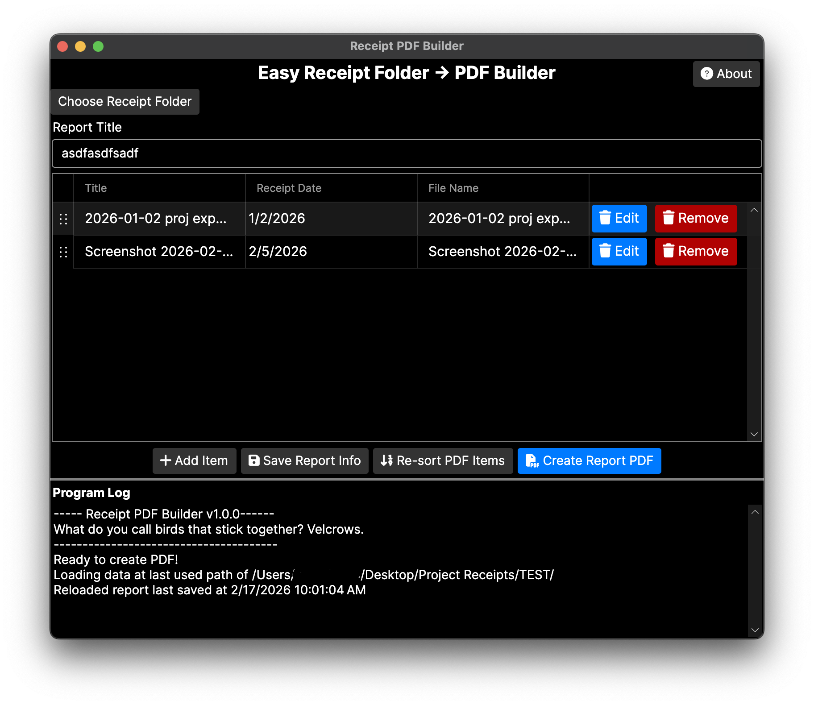

# MayShow

MayShow (an intentional misspelling of 明証, pronounced may-shō, a Japanese word meaning proof, evidence, or corroboration) is a PDF report creation tool.

Throws a folder of images and PDFs into a single PDF. Simple tool for my own use, really, but maybe helpful to someone else.

Icon is from [Font Awesome](https://fontawesome.com/license/free) and generated via [Gauger's FontAwesome icon tool](https://gauger.me/fonticon/) and the macOS software [Icon Composer](https://developer.apple.com/icon-composer/).

Most contributions are welcome; however, no contributions made from AI tools or related software are allowed.