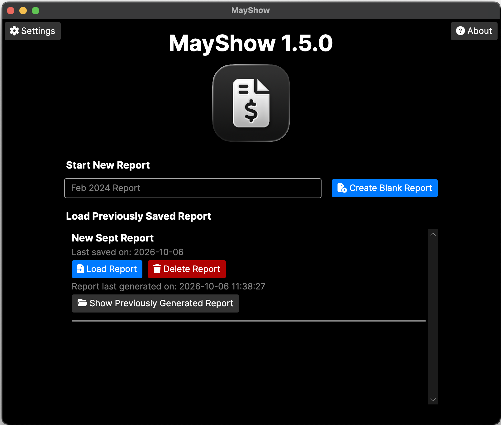
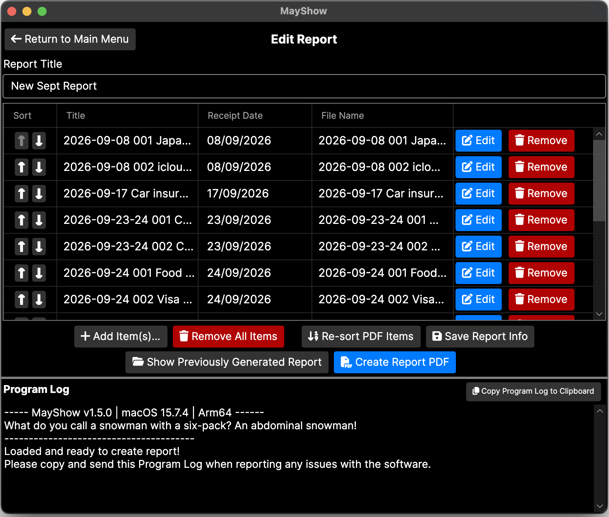
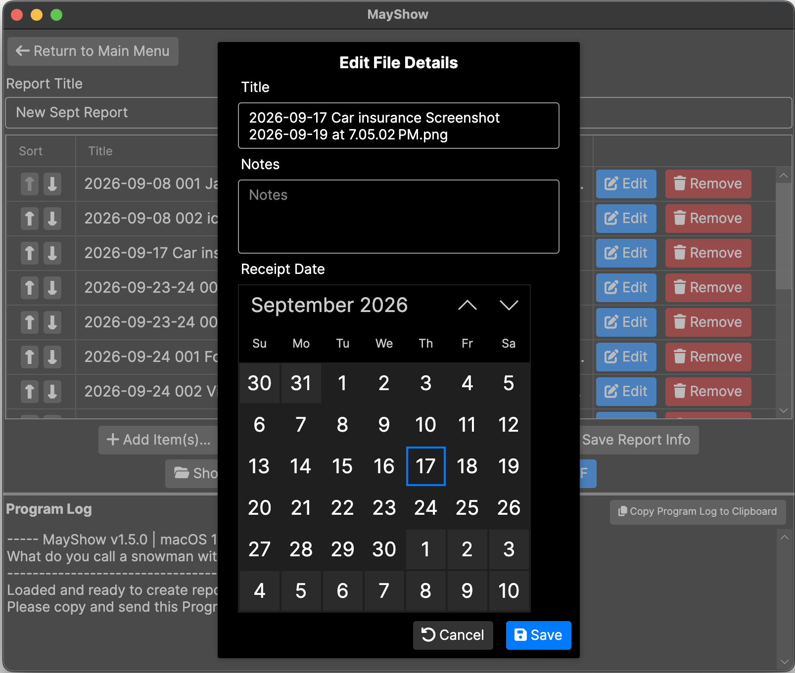

# MayShow

MayShow (an intentional misspelling of 明証, pronounced may-shō, a Japanese word meaning proof, evidence, or corroboration) is a PDF report creation tool that runs on Windows, macOS, and Linux. It is built on top of the Avalonia cross-platform framework. 

An iOS version technically works but needs refinement and publishing to the iOS app store.

The software basically throws a folder of images and PDFs into a single PDF for reporting purposes. Lets you add notes and dates to various items, sort items in the list, and then puts it in one giant PDF while managing titles, fitting the image to the page, etc. for you.

Icon is from [Font Awesome](https://fontawesome.com/license/free) and generated via [Gauger's FontAwesome icon tool](https://gauger.me/fonticon/) and the macOS software [Icon Composer](https://developer.apple.com/icon-composer/).

Most contributions are welcome; however, no contributions made from AI tools or related software are allowed.

## Screenshots

